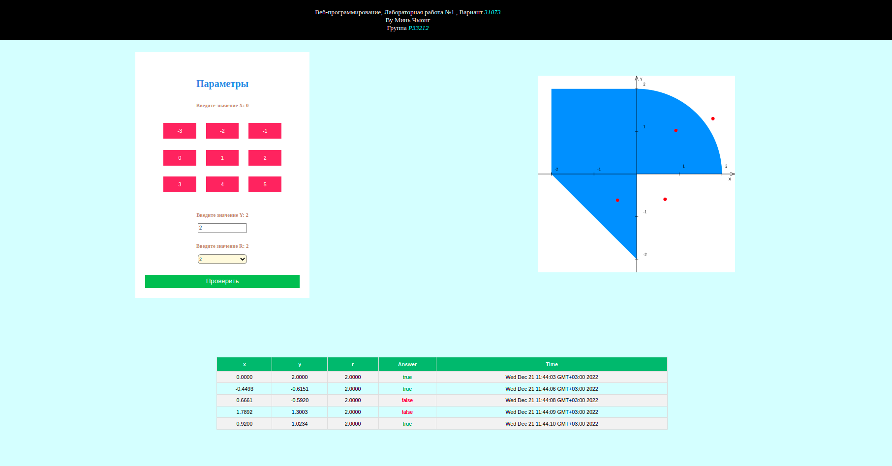
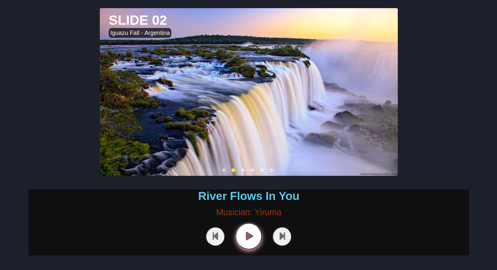
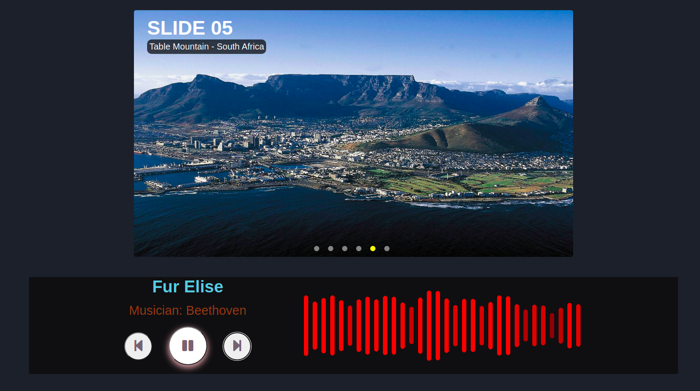

# Lab-web #

### Laboratory №1 #

Develop a web application based on servlets and JSP, which determines whether a point on the coordinate plane falls into a given area.
The application must be implemented according to the MVC pattern and consist of the following elements:

- **ControllerServlet**, which determines the type of request, and, depending on whether the request contains information about the coordinates of the point and the radius, delegating its processing to one of the components listed below. All requests within the application must be sent to this servlet (using the GET or POST method, depending on the job option), other servlets from web pages should not be directly called.
- **AreaCheckServlet**, which checks whether a point falls into an area on the coordinate plane and generates an HTML page with the results of the check. Should process all requests containing information about the coordinates of the point and the radius of the area.
- **JSP page**, generates an HTML page with a web form. Should process all requests that do not contain information about the coordinates of the point and the radius of the area.

**The developed JSP page should contain:**

1. "Header" containing the student's full name, group number and option number.
2. A form that submits data to the server.
3. A set of fields for specifying the coordinates of a point and the radius of an area in accordance with the task option.
4. A JavaScript script that validates the values entered by the user in form fields.
5. An interactive element that contains an image of an area on the coordinate plane (according to the task option) and implements the following functionality:
    - If the area radius is set, the mouse click on the image should be handled by a JavaScript function that determines the coordinates of the point that the user clicked on and sends the resulting coordinates to the server to check for a hit.
    - Otherwise, after clicking on the picture, a message should be displayed about the impossibility of determining the coordinates of the point.
    - After checking whether the point is in the area, the image must be updated with the results of this check (i.e., a new point must appear on it).
6. Table with the results of previous checks. The list of results must be taken from the application context, HTTP session, or bean, as appropriate.

**The page returned by AreaCheckServlet must contain:**

1. A table containing the received parameters.
2. The result of the calculations is the fact that the point hits or misses the area.

### Laboratory №2 #

Implement a web multimedia project "Image Gallery"

**Functional:**
- manual/automatic switching of images;
- each image is accompanied by a text comment;
- setting the switching time (timing);
- enable / disable sound tracks (soundtracks);
- audio track selection (min 3) (or download audio file)
- implement audio visualization of the sound track.

Implementation using HTML5, CSS3, JS, SVG, HTML5 Audio API. Without the use of third-party libraries.
